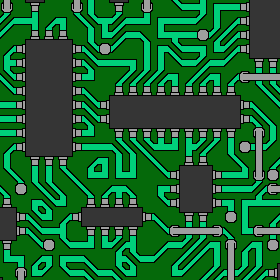
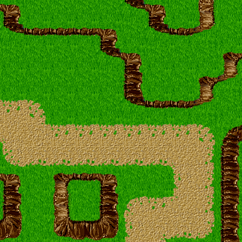
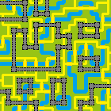

# Wave Function Collapse

As the original, this program generates bitmaps that are locally similar to the input bitmap.
It was made as a programming exercise to learn the Rust programming language, it's the first time I'm using it so it may contain terrible code, you've been warned.
For more information on the ins and outs of the algorithm, refer to the [original repository](https://github.com/mxgmn/WaveFunctionCollapse).

It's based on the SimpleTiledModel.

<p align="center">
  
  
  
</p>

## Usage

Example of usage:
```cargo run -- --tileset Castle --size 20 --limit 1000 --seed 12345 --text --output castle.png```

You can specify any of the tilesets supplied in the tilesets folder, or you can derive your own using a similar structure, using an XML files with tiles and neighbor constraints. I've implemented the symmetry system described by the original author, so you don't need to be exhaustive.
You can avoid specifying an argument if it's not needed (if you don't specify a seed, the program will generate it for you, if you don't specify the output file it will simply be named output.png and so on)

## Algorithm

For a more formal and precise definition, please refer to the original repository.
In brief, it uses a boolean array called wave that maps the possibility of a tile t being in position i. So if a certain tile can be placed in a certain position, `wave[i][t]` will be true.
The program begins with this boolean array filled with true values, since all possible tiles can be placed anywhere.
The objective is to make the function collapse, that is having all `[t]` excluded from position `[i]`except one, for all positions.
At every step, the algorithm selects the next cell with the lowest entropy i.e: the cell that has fewer possibilities left among those that are not yet collapsed. It "observes" the cell, that is, randomly chooses a value for that cell among those that are still possible, and then propagates the result to nearby cells.
Propagating the result means notifying to nearby cells that a certain tile is no longer possible in a specific cell, meaning that all possible combination of tiles that depended upon that tile being present are no longer possible.
The algoritm proceeds in this way until either the wave function has completely collapsed, or we have reached an impossible state, where no further tiles can be placed.

## Future Updates
- Being able to view partially observed states
- Implement the overlapping model
- Implement examples of constrained synthesis